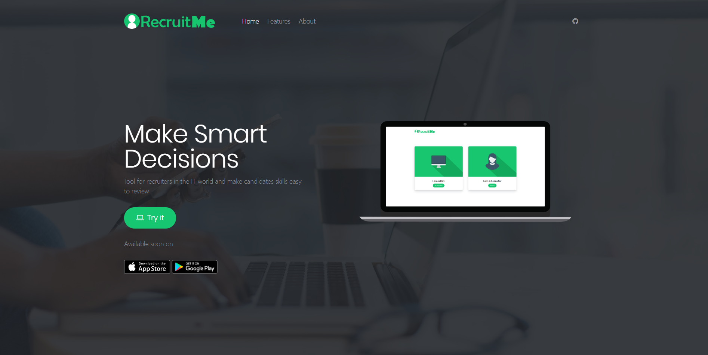

# RecruitMe App

> Tool for recruiters

## Description
Web application for recruiters who want to look for specific information about a candidate in the IT world as english level, what programming languages have used on projects, the number of projects or the number of lines on public repositories, etc.

## Environment
* Python >3.4.3
* Flask
* MySQL 5.7

## Project Notes
* We are using a UI pack called Sharps for the layout of the web app.

## Authors
* **Sergio Rueda** - [sechchr22](https://github.com/sechchr22)
* **Diego Monroy** - [diegozencode](https://github.com/diegozencode)
